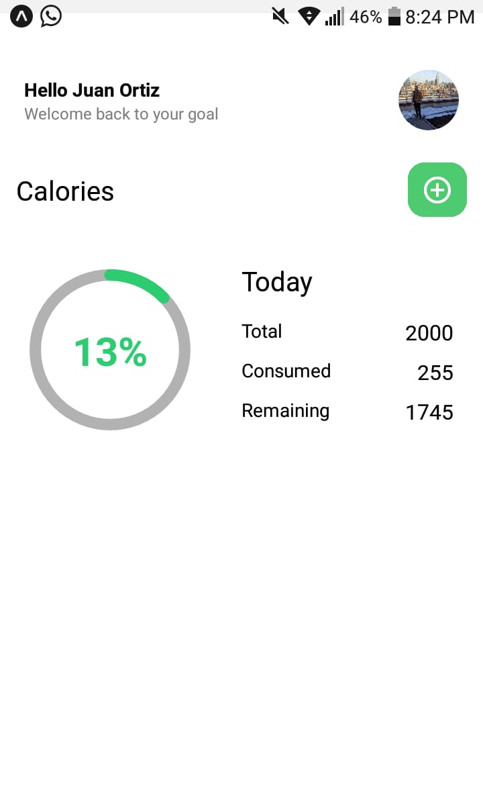
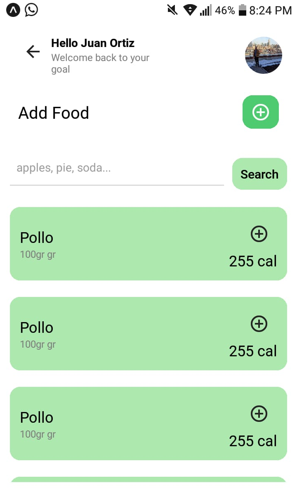

# Calorie Counter Project

## Overview

Welcome to the Calorie Counter project! This mobile application, built with React Native and Expo, helps users keep track of their daily caloric intake, promoting a healthier lifestyle. Whether you're looking to lose weight, maintain a balanced diet, or simply stay mindful of your nutrition, this tool is designed to assist you.

## Features

- *User-Friendly Interface:* Intuitive design for easy navigation.
- *Food Database:* Extensive database with a wide variety of foods and their corresponding calorie counts.
- *Meal Logging:* Log your meals to keep track of daily calorie consumption.
- *Goal Setting:* Set personalized calorie goals based on your fitness objectives.
- *Reports and Analytics:* Visualize your progress over time with detailed reports and analytics.

## Getting Started

### Prerequisites

- Ensure you have [Node.js](https://nodejs.org/) installed on your machine.

### Install Expo CLI globally:

bash
npm install -g expo-cli

1. Clone the repository:
bash
git clone https://github.com/yourusername/calorie-counter.git

2. Navigate to the project directory:
bash
cd calorie-counter

3. Install dependencies:
bash
npm install

#   Usage
1. Start the Expo development server:
bash
expo start

2. Open your Expo client app on your mobile device and scan the QR code displayed in the terminal.

# Contributing
If you'd like to contribute to the project, please follow these steps:

1. Fork the repository.
2. Create a new branch for your feature: git checkout -b feature-new-feature.
3. Commit your changes: git commit -m 'Add new feature'.
4. Push to the branch: git push origin feature-new-feature.
5. Submit a pull request.

# License
This project is licensed under the MIT License - see the LICENSE file for details.

# Acknowledgments
<ul>
<li> Special thanks to Food Database API for providing comprehensive food data. </li>
<li>Inspired by a commitment to healthy living.</li>
</ul>
Feel free to explore and enhance the Calorie Counter project! If you have any questions or suggestions, please create an issue or reach out to the maintainers. Happy tracking! 🥦🏋‍♂

